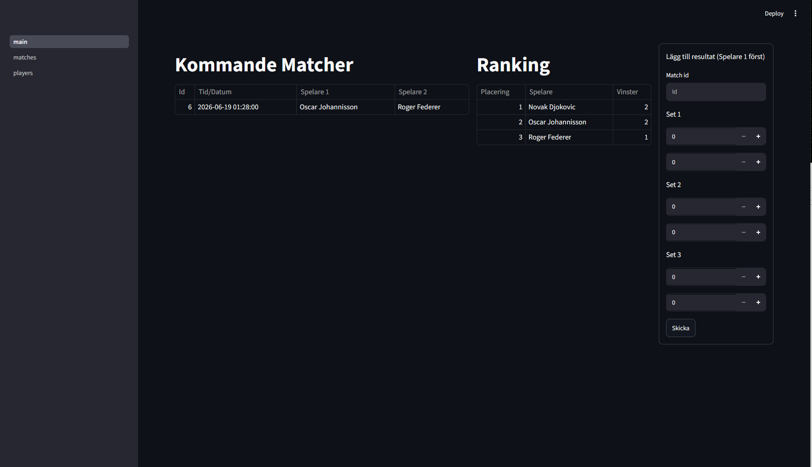
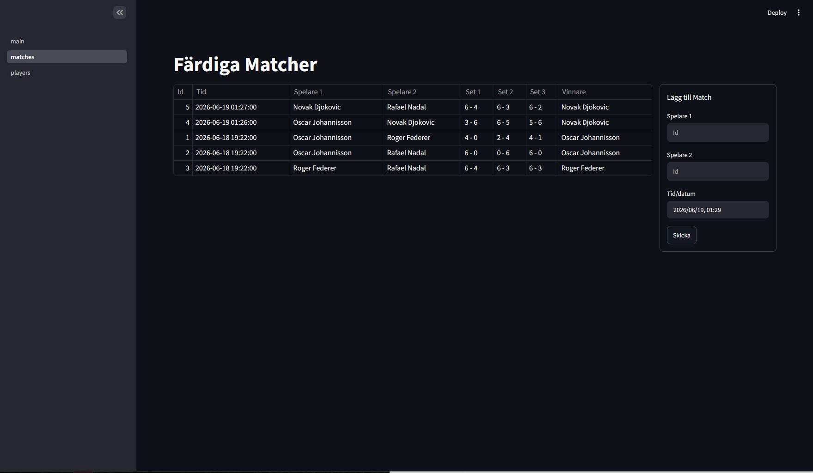
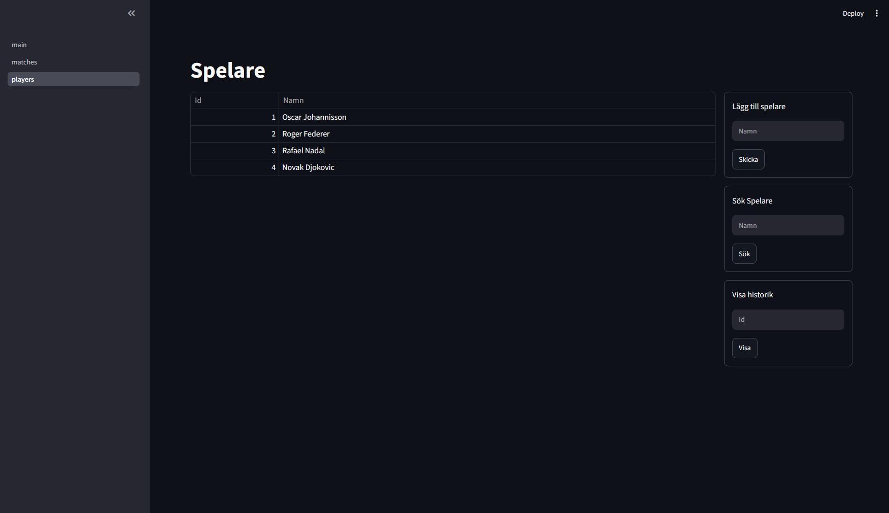

# Easy Score



Easy Score is a web application for managing tennis tournaments.

Working at my local tennis club as a tournament leader, I used an existing tournament management system regularly, registering results, and printing out schedules for upcoming games.

I liked the idea of a large database visualised into multiple pages, but found some parts to be lacking, like the UX and parts of the workflow.

Inspired by my observations using the software I decided to make my own version as a learning experience.

## Functions

Easy Score is divided into three pages: Main, Matches and Players, each with its own functions for interacting with the database.

#### Main

- **Upcoming matches** - a table displaying uncompleted matches (matches without registered results) ordered by the closest date.

- **Leaderboard** - a table displaying a leaderboard ordered by the player in the system with the most wins.

- **Add result form** - a form for registering results to uncompleted matches.

#### Matches

- **Completed matches** - a table displaying all matches with registered results.

- **Add match form** - a form for inserting new matches, that will be displayed in upcoming matches.

#### Players

- **Players** - a table displaying all players registered in the system, alongside their unique ID

- **Add player form** - a form for inserting new players into the system.

## Tech Stack

- Python - Logic and backend
- Streamlit - Frontend
- SQLite - Database

## How to run

**1. Install Dependencies**

```bash
pip install streamlit
```

**2. Run the application**

```bash
streamlit run main.py
```

## Screenshots

### Matches page



### Players page



## Future development

Right now Easy Score has its core functionality that can manage players, matches and results.

In the future I would like to implement tournament bracket generation and more in depth tournament management functions.
